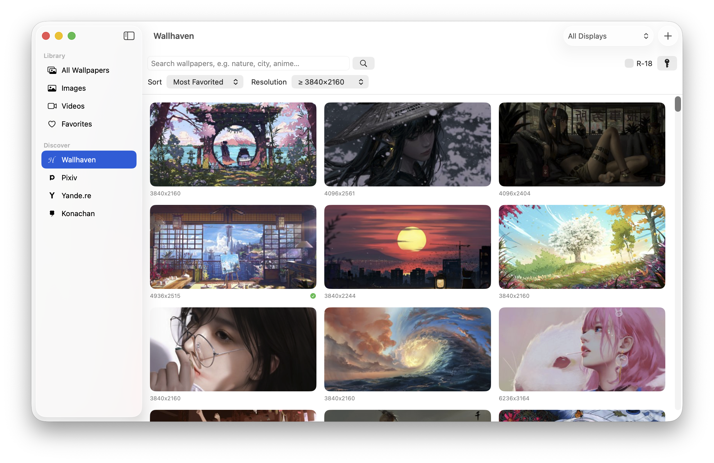

# Wallpaper · 壁纸管理器

一款原生 macOS 壁纸管理应用,使用 **Swift + SwiftUI** 编写,**零第三方依赖**。
支持本地图片 / 视频壁纸、多个在线壁纸源(Wallhaven · Pixiv · Yande.re · Konachan)、多显示器与菜单栏常驻。

简体中文 | [English](README.en.md)


<p align="center">
  
  &nbsp;&nbsp;&nbsp;
  
</p>

## 功能

- **本地壁纸库**:导入图片、视频或整个文件夹(递归扫描),缩略图网格浏览,收藏分类,设为壁纸 / 在访达中显示 / 移除。导入时文件会被**拷贝**进壁纸库目录并按日期编号重命名(如 `20260611-001-a3f2.jpg`),原文件可安全删除;在线下载的壁纸同样按此规则归档。
- **视频壁纸**:支持 mp4 / mov / m4v 循环播放作为动态壁纸(位于桌面图标下方),退出重启后自动恢复;默认静音,可在详情面板中按壁纸开启声音并调节音量(即时生效)。
- **详情面板**:在壁纸库中单击选中壁纸,右侧滑出大预览、分辨率 / 大小 / 时长、来源跳转(回到原页面),并可按壁纸设置显示方式(填充 / 适应 / 拉伸 / 居中)和视频声音;使用中的壁纸调整即时生效。
- **在线壁纸源**:
  - **Wallhaven**(wallhaven.cc):关键词搜索;排序支持热门榜单(可选**今日 / 本周 / 本月**等时间范围)、**最多收藏**、浏览最多、最新、随机;分页加载。NSFW 内容需在顶栏填入 wallhaven 账号的免费 API Key。
  - **Pixiv 排行榜**(pixiv.net):今日 / 本周 / 本月 / 新人榜单免登录浏览(全年龄);开启 R-18 后可浏览 R-18 榜单,需在「登录设置」中填入已开启 R-18 显示账号的 PHPSESSID Cookie(仅保存在本机),自动处理防盗链下载原图。
  - **Yande.re / Konachan**(免登录):高分辨率动漫壁纸站,标签搜索、评分 / 最新排序,R-18 开关切换分级(默认仅全年龄)。
  - **搜索自动翻译**:搜索框可直接输入中文,自动译为英文标签再检索(这些图源标签多为英文),命中率更高,并提示实际搜索词。
  - 均支持一键下载到壁纸库或直接设为壁纸,并可按最低分辨率筛选。
- **多显示器**:工具栏可选择「所有显示器」或某一台单独设置,显示器插拔时自动适配。
- **菜单栏常驻**:关闭主窗口后驻留菜单栏,支持随机切换壁纸、停止视频壁纸等快捷操作。
- **设置**(⌘, 或菜单栏「设置…」):应用内切换**界面语言**(中文 / English)与**外观**(浅色 / 深色 / 跟随系统),均即时生效;可隐藏菜单栏图标。

> ⚠️ 在线源中的 Pixiv / Yande.re / Konachan / Wallhaven 提供 R-18(NSFW)浏览开关。本应用仅为这些站点的**客户端**,不内置任何成人内容;是否开启由你自行决定并遵守当地法律与各站点条款。

## 编译与运行

需要 **macOS 14+** 和 Xcode(或 Xcode Command Line Tools)。

```bash
# 开发运行
swift run

# 打包成可双击的 .app(输出到 build/Wallpaper.app)
./build_app.sh

# 打包 DMG 安装包(输出到 build/Wallpaper-1.0.dmg)
./make_dmg.sh
```

安装:打开 DMG,把 Wallpaper 拖入「应用程序」;在「系统设置 → 通用 → 登录项」中可添加为开机自启。

## 项目结构

```
Sources/WallpaperManager/
├── WallpaperManagerApp.swift   # 应用入口:主窗口 + 设置 + 菜单栏 MenuBarExtra
├── Models.swift                # 壁纸条目数据模型
├── LibraryStore.swift          # 壁纸库:JSON 持久化、导入、收藏、删除、归档命名
├── WallpaperEngine.swift       # 壁纸引擎:图片壁纸(NSWorkspace)+ 视频壁纸窗口(AVPlayerLooper)
├── ThumbnailLoader.swift       # QuickLook 缩略图(图片/视频通用,带缓存)
├── RemoteImageView.swift       # 支持自定义请求头的远程图片视图(下采样 + 缓存)
├── WallhavenAPI.swift          # wallhaven.cc 搜索与下载
├── PixivAPI.swift              # pixiv.net 排行榜与原图下载(Referer 防盗链)
├── MoebooruAPI.swift           # yande.re / konachan 通用客户端(标签搜索、榜单、补全)
├── TranslationService.swift    # 搜索词自动翻译(中文→英文标签)
├── ResolutionFilter.swift      # 最低分辨率筛选
├── SourceLogos.swift           # 在线源单色 logo(模板图,随浅/深色着色)
├── Appearance.swift            # 浅色/深色/跟随系统外观
├── Localization.swift          # 应用内中英文切换
├── Resources/                  # 各图源 logo
└── Views/
    ├── MainWindowView.swift        # 主窗口:侧边栏 + 工具栏
    ├── LibraryGridView.swift       # 本地壁纸网格
    ├── WallpaperInspectorView.swift# 右侧详情/设置面板
    ├── OnlineBrowserView.swift     # Wallhaven 浏览/下载
    ├── PixivBrowserView.swift      # Pixiv 排行榜浏览/下载
    ├── MoebooruBrowserView.swift   # Yande.re / Konachan 浏览/下载
    ├── SettingsView.swift          # 设置(语言 / 外观 / 菜单栏)
    ├── MenuBarView.swift           # 菜单栏菜单
    └── ErrorBanner.swift           # 顶部错误提示条
```

## 实现说明

- **视频壁纸原理**:创建一个无边框窗口,层级设为 `CGWindowLevelForKey(.desktopWindow)`,恰好位于桌面图标之下,内嵌 `AVPlayerLayer` + `AVPlayerLooper` 无缝循环播放。这是 Plash 等动态壁纸应用的通用方案,不需要任何特殊权限。
- **图片壁纸**:`NSWorkspace.setDesktopImageURL(_:for:options:)`,逐屏设置。
- **数据存放**:壁纸库索引与在线下载的图片保存在 `~/Library/Application Support/WallpaperManager/`。API Key、Pixiv Cookie 等仅保存在本机 `UserDefaults`,**不随代码上传**。

## 已知限制

- 图片壁纸只对**当前桌面空间 (Space)** 生效,这是 macOS API 的限制(系统设置中的壁纸面板也是如此)。
- 视频壁纸由本应用的窗口承载,**退出应用后视频壁纸会消失**(下次启动自动恢复)。
- Ad-hoc 签名仅供本机使用;若要分发给他人,需要 Apple 开发者证书签名与公证。
- 搜索自动翻译使用免费的公共翻译接口,偶发失败时会自动回退为原词搜索。

## 许可证

[MIT](LICENSE) © 2026 Forya-1220
